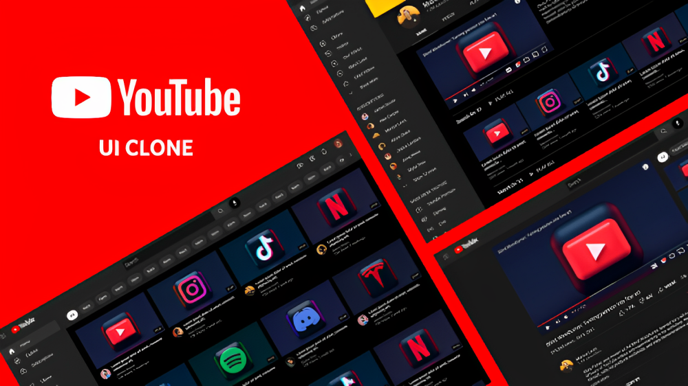

# YouTube Clone



## Description

The fully responsive YouTube Clone application built with React.js, the YouTube API, Axios, and Bootstrap aims to replicate the core functionality and user experience of YouTube while providing a seamless and intuitive interface for users to discover, watch, and engage with videos.

## Features

- Home Page: Displays a curated list of popular and trending videos, similar to the YouTube homepage. Users can browse and click on videos to watch them.
- Search Functionality: Users can enter search queries to find videos, channels, and playlists. The application sends the query to the YouTube API and displays the search results.
- Video Player: Allows users to watch videos within the application. The video player supports features such as playback controls, full-screen mode, volume control, and video quality selection.
- Video Recommendations: Based on the user's viewing history and preferences, the application provides personalized video recommendations in a sidebar or at the end of videos.
- Channel Pages: Users can explore individual channels, view channel details, and watch videos uploaded by specific channels. It may also display information about the channel's subscribers and playlists.
- Responsive Design: The application is designed to adapt to different screen sizes and devices, ensuring an optimal viewing experience across desktops, tablets, and mobile phones.

## Technologies Used

- [YouTube API](https://developers.google.com/youtube/registering_an_application): Used for integrating YouTube video content and functionality into applications.
- [Axios](https://axios-http.com/): A popular HTTP client for making API requests.
- [Bootstrap](https://getbootstrap.com/): A front-end framework that simplifies web design and development with pre-built components and responsive design features.

## Getting Started

To run the Stack Overflow Clone locally, follow these steps:

1. Clone the repository to your local machine:

   ```bash
   git clone https://github.com/Mukesh-Sharma400/YouTube-Clone.git
   ```

2. Install all dependencies by navigating to the project's root directory and running the following command:

   ```bash
   npm install
   ```

3. Start the project by running the following command into the project's root directory:

   ```bash
   npm start
   ```
